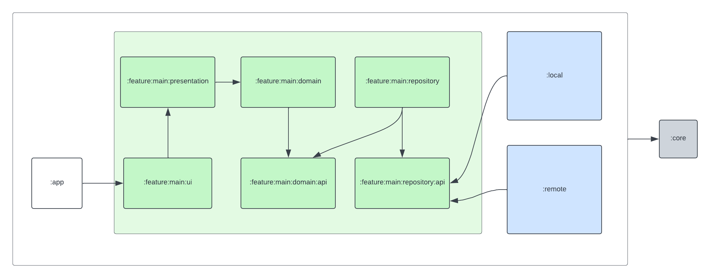

# Project Documentation
## Setting Up Git Hooks

This project uses Git hooks to enforce code style and quality checks. To install the hooks:

1.  Navigate to the root directory of the project in your terminal.
2.  Run the following command:
    ```bash
    ./install-git-hooks.sh
    ```

## Modular System Design:

